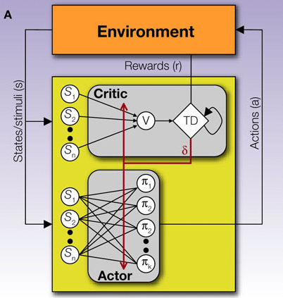
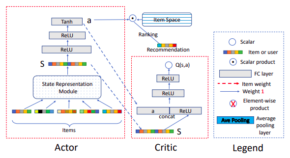

# Deep-RL-Recommender-System
<h2>Problem Statement</h2>
The goal of this project is to implement a recommendation framework based on deep reinforcement learning which adopts actor-critic learning scheme

Source: MovieLens 1M Dataset,    	 
        https://grouplens.org/datasets/movielens/1m

Implementation of research paper Deep Reinforcement Learning based Recommendation with Explicit User-Item Interactions Modeling (2019)
<h2> Groups of Reinforcement Learning </h2>

  

<h2> Actor Critic </h2>
Actor :  Policy Based
Critic :  Value Based

  

<h2> Agent & Environment </h2>
State: User positive interaction history with recommender
Action: Recommendations
Environment: User
Agent: Recommender
Reward: (1 if rating>3, 0 otherwise)

<h2> Overall Model </h2>

  

<h2> Evaluation metrics </h2>
NDCG (Normalized Discounted Cumulative Gain)

Hit Rate

<h2> Results and model Comparison </h2>

  

